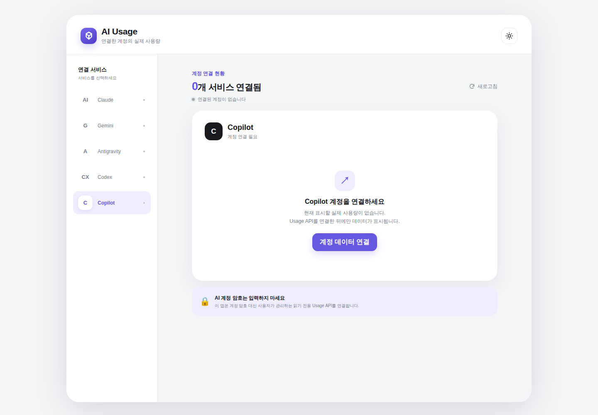

# AI Usage

여러 AI 서비스 계정의 **실제 사용량**과 재설정 일정을 모바일에서 한눈에 확인하는 웹 대시보드입니다. 연결하지 않은 계정의 수치를 임의로 표시하지 않습니다.




## 주요 기능

- Claude, Gemini, Antigravity, Codex, Copilot별 Usage API 연결
- **그래프 시각화**: 전체 평균 사용률 도넛 게이지, 서비스별 요약 링 스트립, 사용 추이(면적 차트)
- **상단 서비스 네비게이션**(모바일) · 데스크톱 사이드바
- API 응답 검증 후 실제 사용량, 한도, 다음 재설정 시각 표시
- 전체 연결 새로고침, 연결 상태 및 실패 상태 표시
- 화면이 열려 있는 동안 60초마다 자동 갱신하며 API 기준 시각 표시
- API 토큰은 `localStorage`에 기록하지 않고 현재 탭의 메모리에만 보관
- 계정 연결 해제 및 마지막 선택 서비스 저장
- 시스템 설정을 반영하는 라이트/다크 테마
- 모바일, 태블릿, 데스크톱에 대응하는 반응형 레이아웃
- 데스크톱에서는 서비스 사이드바와 넓은 대시보드 레이아웃 제공

## 실행하기

별도의 빌드 과정이나 의존성이 필요하지 않습니다.

```bash
python3 -m http.server 4173 --directory docs
```

브라우저에서 <http://localhost:4173>을 열어 확인합니다.

## GitHub Pages 배포

저장소의 **Settings → Pages**에서 배포 소스를 `main` 브랜치의 `/docs` 폴더로 설정하면 정적 웹앱을 배포할 수 있습니다.

## 실제 계정 연결

AI Usage는 AI 서비스 아이디/암호를 수집하지 않습니다. 각 공급자의 **공식 API 키/토큰**으로 사용량을 조회합니다. 연결 방법은 두 가지입니다.

### 방법 A — API 키로 연결 (권장, 쉬움)

1. 프록시(어댑터)를 실행합니다. `node server/proxy.js` (기본 `http://localhost:8787`)
2. 상단(모바일)/사이드바(데스크톱)에서 서비스를 선택하고 **API 키로 연결**을 누릅니다.
3. 연결 창에서
   - **1단계**: 위 프록시 주소를 입력합니다.
   - **2단계**: 각 공급자의 공식 API 키/토큰을 붙여넣습니다. 창에 발급 페이지 바로가기 링크가 있습니다.
4. **연결 및 확인**을 누르면 프록시가 실제 API를 호출해 사용량을 그래프로 표시합니다.

키는 이 브라우저(`localStorage`)와 위 프록시로만 전송되며 외부로 나가지 않습니다. 되도록 **읽기 전용·최소 권한** 키를 사용하세요.

| 서비스 | 입력하는 키 | 발급 위치 |
| --- | --- | --- |
| Claude | Anthropic **Admin API 키** (`sk-ant-admin...`) + 월 예산(선택) | console.anthropic.com → Settings → Admin keys |
| Codex | OpenAI **API 키** (`sk-...`) + 조직 ID(선택) + 월 예산(선택) | platform.openai.com → API keys |
| Copilot | GitHub **토큰(PAT)** + 조직/사용자명 | github.com → Settings → Developer settings → Tokens |
| Gemini | Google **API 키** (`AIza...`) | aistudio.google.com → API keys (사용률 API 미제공, 키 확인만) |
| Antigravity | — | 공개 사용량 API 없음 (미지원) |

> 소비자 서비스(claude.ai · chatgpt.com · gemini)는 **아이디/비밀번호로 사용량을 조회하는 공개 API가 없습니다.** 그래서 계정 비밀번호가 아니라 위의 API 키/토큰을 사용합니다.

### 방법 B — 직접 어댑터 주소 (고급)

이미 Usage API 어댑터를 운영 중이라면, 연결 창의 **직접 어댑터 주소** 탭에서 아래 JSON을 반환하는 HTTPS 주소를 바로 연결할 수 있습니다. 응답은 브라우저 접근을 허용하는 CORS 헤더가 필요합니다.

```json
{
  "account": "my-account",
  "updatedAt": "2026-08-09T09:00:00Z",
  "resetAt": "2026-09-01T09:00:00+09:00",
  "metrics": [
    { "label": "프리미엄 요청", "used": 12, "limit": 300 }
  ],
  "history": [
    { "date": "2026-08-01", "used": 8, "limit": 300 }
  ]
}
```

`limit`를 제공하지 않는 항목은 횟수만 표시합니다. `history`(선택)를 제공하면 사용 추이 그래프가 표시되며, 없으면 그래프는 표시되지 않습니다(임의로 지어내지 않습니다). 브라우저를 닫으면 토큰은 사라지므로 다음 접속 때 토큰이 필요한 연결은 다시 인증해야 합니다.

### 프록시(server/proxy.js) 동작 방식

각 공급자의 실제 API를 호출해 위 형식으로 정규화하는 **동작하는 어댑터**입니다. 외부 의존성 없이 Node 18+ 로 실행되며, 두 가지 경로를 제공합니다.

- `POST /api/usage` — **방법 A**가 사용. 브라우저가 입력한 키를 `{ provider, creds }` 로 보내면 프록시가 대신 호출합니다.
- `GET /claude` 등 — 키를 환경 변수로 미리 주입해두고 **방법 B**로 URL만 연결하는 방식.

```bash
# 방법 A: 키 없이 실행 (키는 대시보드 UI에서 입력)
node server/proxy.js          # 기본 http://localhost:8787

# 방법 B: 환경 변수로 키를 주입하고 GET /claude 등을 직접 연결
ANTHROPIC_ADMIN_KEY=sk-ant-admin... ANTHROPIC_BUDGET=100 \
OPENAI_API_KEY=sk-... OPENAI_BUDGET=100 \
GITHUB_TOKEN=ghp_... GITHUB_ORG=my-org \
GEMINI_API_KEY=AIza... \
node server/proxy.js
```

| 서비스 | 조회 내용 |
| --- | --- |
| Claude | 이번 달 비용/예산(일별 추이 포함) |
| Codex | 이번 달 비용/예산(일별 추이 포함) |
| Copilot | 활성/비활성 좌석 |
| Gemini | 키 유효성(공개 사용률 API 미제공) |

자동 갱신은 화면이 보이는 동안 60초마다 실행됩니다. 이는 Usage API가 반환하는 최신 데이터를 다시 가져오는 방식이며, 공급자의 사용량 반영 지연보다 빠르게 갱신되거나 스트리밍 방식으로 전달되는 것은 아닙니다.

각 API 요청은 12초 후 자동으로 중단되며, 인증 만료·잘못된 JSON·CORS 및 네트워크 오류를 구분해 안내합니다. 저장된 연결 정보가 손상되었거나 안전하지 않은 HTTP 주소를 포함하면 해당 설정은 자동으로 제외됩니다.

### 보안 및 공급자 제한

- 정적 GitHub Pages에는 OAuth 비밀 키나 서비스 토큰을 안전하게 저장할 수 없습니다.
- Claude, Gemini, Codex, Copilot의 일반 사용자용 웹 구독 사용량은 공급자가 공개 API로 제공하지 않을 수 있습니다.
- 계정 암호, 세션 쿠키 또는 쓰기 권한 토큰을 이 앱에 입력하지 마세요.
- 조직용 비용/사용량 API와 개인 구독 사용량은 서로 다른 데이터일 수 있습니다.

## 프로젝트 구조

```text
docs/
├── index.html    # 화면 구조와 접근성 마크업
├── styles.css    # 반응형 UI 및 테마
├── app.js        # 서비스 연결과 화면 상호작용
├── charts.js     # 의존성 없는 인라인 SVG 차트(도넛/면적/미니링)
└── usage-core.js # API 응답 검증 및 사용률 계산
server/
└── proxy.js      # 공급자 API를 대시보드 형식으로 정규화하는 어댑터 예제
```

## 테스트

```bash
node --test
```

> 연결 전에는 사용량이 표시되지 않습니다. 성공적으로 검증된 Usage API 응답만 화면에 표시합니다.
