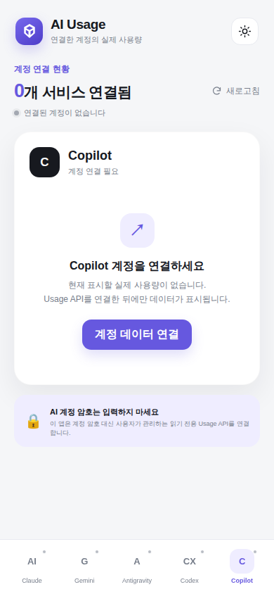

# AI Usage

여러 AI 서비스 계정의 **실제 사용량**과 재설정 일정을 모바일에서 한눈에 확인하는 웹 대시보드입니다. 연결하지 않은 계정의 수치를 임의로 표시하지 않습니다.



## 주요 기능

- Claude, Gemini, Antigravity, Codex, Copilot별 Usage API 연결
- API 응답 검증 후 실제 사용량, 한도, 다음 재설정 시각 표시
- 전체 연결 새로고침, 연결 상태 및 실패 상태 표시
- API 토큰은 `localStorage`에 기록하지 않고 현재 탭의 메모리에만 보관
- 계정 연결 해제 및 마지막 선택 서비스 저장
- 시스템 설정을 반영하는 라이트/다크 테마
- 모바일, 태블릿, 데스크톱에 대응하는 반응형 레이아웃

## 실행하기

별도의 빌드 과정이나 의존성이 필요하지 않습니다.

```bash
python3 -m http.server 4173 --directory docs
```

브라우저에서 <http://localhost:4173>을 열어 확인합니다.

## GitHub Pages 배포

저장소의 **Settings → Pages**에서 배포 소스를 `main` 브랜치의 `/docs` 폴더로 설정하면 정적 웹앱을 배포할 수 있습니다.

## 실제 계정 연결

AI Usage는 사용자의 AI 서비스 아이디나 암호를 수집하지 않습니다. 각 서비스의 개인 구독 사용량 API 제공 여부와 인증 방식이 서로 다르므로, 공급자가 제공하는 API 또는 사용자가 운영하는 읽기 전용 어댑터를 연결합니다.

1. 하단에서 서비스를 선택합니다.
2. **계정 데이터 연결**을 누릅니다.
3. HTTPS Usage API 주소와 필요한 경우 읽기 전용 토큰을 입력합니다.
4. 응답을 검증하고 성공한 경우에만 해당 서비스를 연결됨으로 표시합니다.

Usage API는 다음 JSON 형식을 반환해야 하며, 브라우저 접근을 허용하는 CORS 헤더가 필요합니다.

```json
{
  "account": "my-account",
  "updatedAt": "2026-08-09T09:00:00Z",
  "resetAt": "2026-09-01T09:00:00+09:00",
  "metrics": [
    { "label": "프리미엄 요청", "used": 12, "limit": 300 }
  ]
}
```

`limit`를 제공하지 않는 항목은 횟수만 표시합니다. 브라우저를 닫으면 토큰은 사라지므로 다음 접속 때 토큰이 필요한 연결은 다시 인증해야 합니다.

### 보안 및 공급자 제한

- 정적 GitHub Pages에는 OAuth 비밀 키나 서비스 토큰을 안전하게 저장할 수 없습니다.
- Claude, Gemini, Codex, Copilot의 일반 사용자용 웹 구독 사용량은 공급자가 공개 API로 제공하지 않을 수 있습니다.
- 계정 암호, 세션 쿠키 또는 쓰기 권한 토큰을 이 앱에 입력하지 마세요.
- 조직용 비용/사용량 API와 개인 구독 사용량은 서로 다른 데이터일 수 있습니다.

## 프로젝트 구조

```text
docs/
├── index.html   # 화면 구조와 접근성 마크업
├── styles.css   # 반응형 UI 및 테마
└── app.js       # 서비스 데이터와 화면 상호작용
```

> 연결 전에는 사용량이 표시되지 않습니다. 성공적으로 검증된 Usage API 응답만 화면에 표시합니다.
